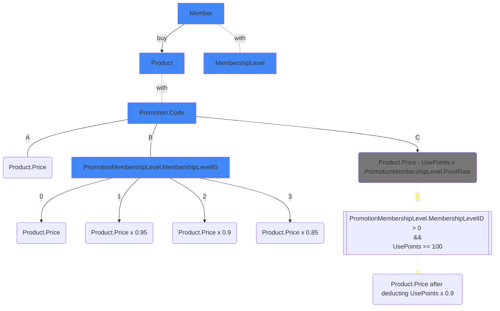

# Table of contents

- [Requirement](#requirement)
- [Description](#description)
- [Diagram](#diagram)
  - [Model](#model)
  - [Flowchart](#flowchart)
- [Directory structure](#directory-structure)
- [How to use](#how-to-use)

## Requirement

- Golang (v1.18)

## Description

針對平台產品銷售有不同的收費機制，該系統中有平台點數及平台幣（平台幣是主要扣款使用的幣別）

依照不同商品及不同的用戶等級會有不同的收費模式

主要收費模式會分成下列三種

A、正常平台幣收費

B、VIP 會員有平台幣優惠價格（各個等級的折扣會依照活動做調整）

- VIP1：95 折
- VIP2：9 折
- VIP3：85 折

C、扣平台點數折抵平台幣優惠（折抵比例依照活動做調整）

設定平台點數 1:1 折抵，則 1000 元商品可以使用 100 點扣抵扣再另外支付 900 元購買

平台會不定時舉辦各式的優惠活動，活動時會彈性調整方案 B 及方案 C 的優惠內容，依照不同的活動內容可以排程調整活動

1. 請使用 Golang 實作一個收銀系統（考慮 Clean Code、Design Pattern）
2. 承上題，平台後來新增了另一個收費模式，如果有 VIP 身份扣 100 點以上折抵，另外享再 9 折優惠（考慮 SOLID）

## Diagram

### Model

```mermaid
erDiagram

Member {
  uint   ID
  uint   Status
  uint   Points
  uint   MembershipLevelID
}


MembershipLevel {
  uint   ID
  string Title
}

Product {
  uint   ID
  uint   Price
  uint   PromotionID
  string Title
}

Promotion {
  uint   ID
  uint   PromotionMembershipLevelID
  string Code
  string Title
}

PromotionMembershipLevel {
  uint    ID
  uint    PromotionID
  uint    MembershipLevelID
  float32 MembershipPercentOff
  float32 PotinRate
}

Member          ||--|| MembershipLevel: one-to-one
Product         ||--|| Promotion: one-to-one
Promotion       }o--o{ PromotionMembershipLevel: many-to-many
MembershipLevel }o--o{ PromotionMembershipLevel: many-to-many
```

### Flowchart



## Directory structure

```
simple-factory
├── cashier
│   ├── factory 
│   └── model
└── example
```

## How to use

Please refer to [example](https://github.com/uhcakip/simple-factory/tree/master/example)